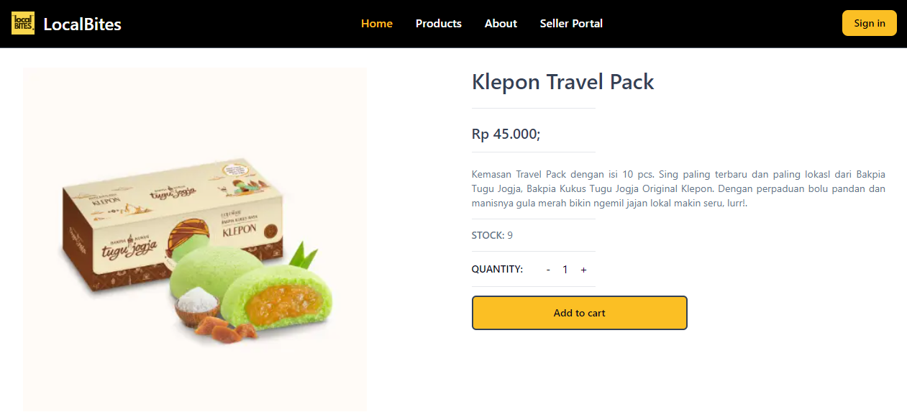

# FSSE_JAN24_GroupF_GFP_Frontend
Frontend repository for the final project of PRevoU Fullstack Software Engineering Bootcamp Section Amsterdam - Group F

Backend Repository https://github.com/anojumisa/FSSE_JAN24_GroupF_GFP_Backend.git

## Table of Contents
- [About the Project](#about-the-project)
- [Overview](#overview)
- [Features](#features)
- [Tech Stack](#tech-stack)
- [Installation](#installation)
- [Environment Variables](#environment-variables)
- [Running the Application](#running-the-application)
- [Screenshots](#screenshots)

## About the Project
LocalBites is a digital marketplace that connect food lovers with passionate artisans who craft delicacies with love and local ingredients. LocalBites is not just about indulging souvenirs but also committed to preserving the planet for future generations. That's why we've built a sustainable ecosystem around our business. Our delivery fleet consists of eco-friendly bicycles, reducing carbon emissions and supporting local communities. Our packaging is meticulously chosen to be recyclable, minimizing waste.

By choosing LocalBites, you're not just satisfying your cravings; you're also contributing to a greener planet. Every purchase brings you closer to the heart of a community and supports sustainable practices.

## Overview
This is the frontend for an e-commerce application built using [Next.js](https://nextjs.org/) and [TypeScript](https://www.typescriptlang.org/). It interacts with the backend API to provide a seamless shopping experience.

## Features
- User Authentication
- Product Catalog and Browsing
- Shopping Cart Management
- Checkout Process

## Tech Stack
- **Frontend**: Next.js, TypeScript, Formik (for form validation)
- **Styling**: Tailwind

## Installation

### Prerequisites
- Node.js (v14 or higher)

### Setup
1. Clone the repository:
   ```bash
   git clone https://github.com/anojumisa/FSSE_JAN24_GroupF_GFP.git
   cd your-frontend-repo

2. Install the dependencies:
    ```bash
    npm install

3. Set up the environment variables (see [Environment Variables](#environment-variables)).

## Environment Variables
Create a .env.local file in the root directory and add the following environment variables:

```bash
NEXT_PUBLIC_API_URL=http://localhost:5000/api
```

## Running the Application
Start the development server:
```bash
npm run dev
```

## Screenshots

### Landing Page


### About Page


### Developers Team


### Register and Login User


### Register and Login Seller


### Dashboard User


### Dashboard Seller


### Products


### Single Product


### Cart


### Order


### Payment